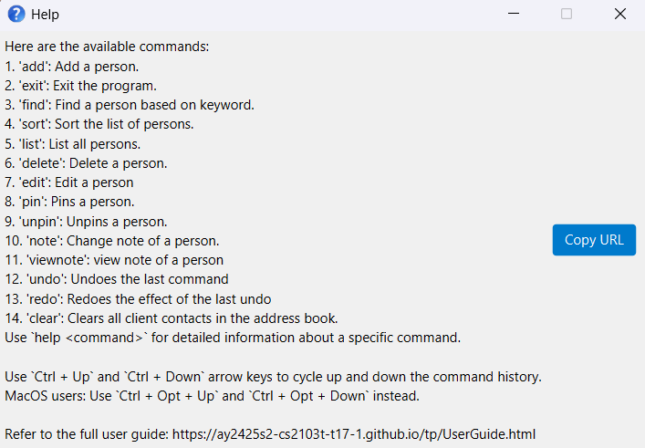
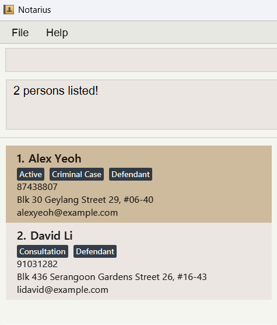
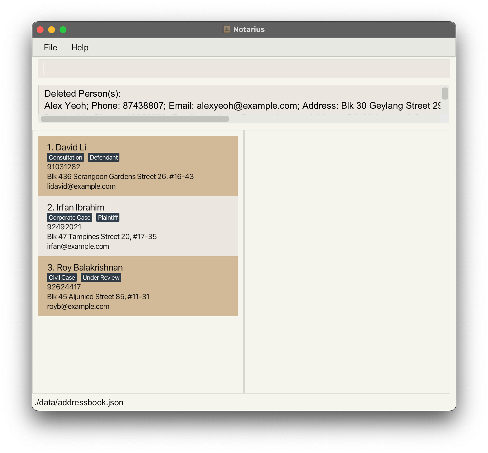

* Table of Contents
{:toc}

--------------------------------------------------------------------------------------------------------------------

## Introducing Notarius

*Ever a **fast-typing lawyer** with **too many** clients to manually keep track of in your slow and cumbersome contact app? We offer a **far better** alternative.*

**Notarius** is a **desktop addressbook** application on ***steroids***, meticulously refined for **lawyers** to track and manage their
clients' contact information. The app speeds up client contact management processes by providing fast-typing lawyers with a **Command Line Interface** (CLI) based input,
while also providing a seamless and intuitive **Graphical User Interface** (GUI) for visual cues to those who prefer it.

## Features Overview

While this application may seem *as-if* it were a *typical* address-book application, allowing you to
list, add, edit and delete client contacts, **Notarius** is packed with convenient and essential features that drive your productivity at work,
helping to provide you with a seamless experience. You can re-access previously typed commands, undo/redo them, search for client contacts, and even sort them.

Additionally, we offer **cool** *quality-of-life* features too. You can note-take crucial details of your clients, and even pin important client contacts!

| Feature         | Purpose                                                                                  |
|-----------------|------------------------------------------------------------------------------------------|
| Note            | Add and view notes of client contacts to keep track of important information about them. |
| Pin/Unpin       | Pin and unpin client contacts to easily track important client information.              |
| Sort            | Sort clients by key attributes to easily find certain clients.                           |
| Find            | Filters clients by various fields along with how similar they are to the query commands. |
| Undo/Redo       | Undo and redo commands to easily correct mistaken commands.                              |
| Command History | View and reaccess previously typed commands to easily edit typos.                        |

## Glossary of terms

While exploring this user guide, you may come across some terms that you may not be familiar with.
Here is a list of commonly used terminology to provide better clarity.

| Terms                 | Meaning                                                                                                                                                                                                                                                                                                                           |
|-----------------------|-----------------------------------------------------------------------------------------------------------------------------------------------------------------------------------------------------------------------------------------------------------------------------------------------------------------------------------|
| Prefix                | Prefixes are short markers that are used to specify the type of information following it. For instance, `n/` is a prefix that specifies that the data following it (up until another prefix) is the name of a client.                                                                                                             |
| Command/Command input | A command (input) is a specific instruction that a user types into the input box to tell Notarius what to do. Commands help users interact with Notarius by performing actions like adding, searching, or deleting data. Commands that do not match actions that can be performed by Notarius will be considered invalid/unknown. |
| Index                 | Index refers to the position of a client in the list of clients displayed by Notarius. For example, an `INDEX` of 1 refers to the first client in the displayed list.                                                                                                                                                             |
| Operating System/OS   | The type of computer software that you are using, commonly referred to as OS. Examples include **Windows**, **macOS**, and **Linux**. Click <a href="https://en.wikipedia.org/wiki/Operating_system">here</a> to learn more.                                                                                                      |
| Whitespace Character  | Usually refer to characters entered by a user's keyboard that are not visible. Examples include spaces (by pressing space-bar), tabs (by pressing the tab key), and new lines (from pressing enter).                                                                                                                              |
| Blank Inputs          | Inputs entered by users that are either empty or only contain whitespace characters                                                                                                                                                                                                                                               |

## Quick start

1. Ensure you have Java `17` or above installed in your Computer. 
   **Mac users:** Ensure you have the precise JDK version prescribed [here](https://se-education.org/guides/tutorials/javaInstallationMac.html).

1. Download the latest `.jar` file from [here](https://github.com/AY2425S2-CS2103T-T17-1/tp/releases). 
   * Under `Assets` of the latest release, click on `Notarius.jar` to download it.

1. Copy the file to an empty folder where you want to store all your contact information for Notarius.

1. Follow the steps for your device:

    

        
 Windows

        <pre>

    1. Copy the path of the folder
        - Right-click the folder and select "Copy as Path".

    2. Open a command terminal
        - Press Win + X, then select Terminal.

    3. Navigate to the folder
        - Type "cd" and paste the copied path, then press Enter.

    4. Run the application
        - Type "java -jar Notarius.jar" and press Enter.
   
           </pre>
       

    

      
MacOS

      <pre>
    1. Copy the path of the folder
        - Right-click the folder, hold Opt, then click "Copy (folder name) as Pathname".

    2. Open a command terminal
        - Press Cmd + Space to open Spotlight, type "Terminal", and press Enter.

    3. Navigate to the folder
        - Type "cd" and paste the copied path, then press Enter.

    4. Run the application
        - Type "java -jar Notarius.jar" and press Enter.
      </pre>
    

    

      
Linux

      <pre>

    1. Copy the path of the folder
        - Click the address bar of the folder (this might require pressing Ctrl + L).
        - Copy with Ctrl + C.

    2. Open a command terminal
        - Press Ctrl + Alt + T.

    3. Navigate to the folder
        - Type "cd" and paste the copied path, then press Enter.

    4. Run the application
        - Type "java -jar Notarius.jar" and press Enter.

      </pre>
    

 
A GUI similar to the below should appear in a few seconds. Note how the app contains some sample data.

1. Type the command in the command box and press Enter to execute it. e.g. typing **`help`** and pressing Enter will open the help window. 
   Some example commands you can try:

    * `list` : Lists all contacts.

    * `add n/John Doe p/98765432 e/johnd@example.com a/John street, block 123, #01-01` : Adds a contact named `John Doe` to the Address Book.

    * `delete 3` : Deletes the 3rd contact shown in the current list.

    * `clear` : Deletes all contacts.

    * `exit` : Exits the app.

1. Refer to the [Features](#features) below for details of each command.

--------------------------------------------------------------------------------------------------------------------

## Overview of UI

  

  

--------------------------------------------------------------------------------------------------------------------

## Features

**:information_source: Notes about the command format:** 

* Words in `UPPER_CASE` are the parameters to be supplied by the user. 
  e.g. in `add n/NAME`, `NAME` is a parameter which can be used as `add n/John Doe`.

* Items in square brackets are optional. 
  e.g `n/NAME [t/TAG]` can be used as `n/John Doe t/friend` or as `n/John Doe`.

* Items with `…`​ after them can be used multiple times including zero times. 
  e.g. `[t/TAG]…​` can be used as ` ` (i.e. 0 times), `t/friend`, `t/friend t/family` etc.

* Parameters can be in any order. 
  e.g. if the command specifies `n/NAME p/PHONE_NUMBER`, `p/PHONE_NUMBER n/NAME` is also acceptable.

* Extraneous parameters for commands that do not take in parameters (such as `list`, `exit` and `clear`) will be ignored. 
  e.g. if the command specifies `list 123`, it will be interpreted as `list`.

* If you are using a PDF version of this document, be careful when copying and pasting commands that span multiple lines as space characters surrounding line-breaks may be omitted when copied over to the application.

### Basic Features

#### Viewing help : `help`

The `help` command provides guidance on how to use the application, including available commands and their formats.

Format: `help [COMMAND]`

* Display general help message when used without arguments.
* Provides specific command help with format and example of usage
  when a valid command name is specified.
* Case-insensitive command lookup (e.g.`help FiNd` works for `find`).
* Handles unknown commands gracefully, informing the user if the command does not exist.

Examples:
* `help add` displays the correct format and usage of the `add` command.
* `help me` returns: `"Unknown command! Use 'help' to see available commands.`

#### Adding a client contact: `add`

Adds a client contact to the address book.

Format: `add n/NAME p/PHONE_NUMBER e/EMAIL a/ADDRESS [t/TAG] [t/ADDITIONAL TAG]…​`

:bulb: **Tip:**
A contact can have any number of tags (including 0)

Examples:
* `add n/John Doe p/98765432 e/johnd@example.com a/John street, block 123, #01-01`
* `add n/Betsy Crowe t/DUI e/betsycrowe@example.com a/Newgate Prison p/1234567 t/case44`

#### Listing all client contacts : `list`

Shows a list of all contacts in the address book.

Format: `list`

#### Editing a client contact : `edit`

Edits an existing contact in the address book.

Format: `edit INDEX [n/NAME] [p/PHONE] [e/EMAIL] [a/ADDRESS] [t/TAG] [t/ADDITIONAL TAG]…​`

* Edits the contact at the specified `INDEX`. The index refers to the index number shown in the displayed person list. The index **must be a positive integer** 1, 2, 3, …​
* At least one of the optional fields must be provided.
* Existing values will be updated to the input values.
* When editing tags, the existing tags of the contact will be removed i.e adding of tags is not cumulative.
* You can remove all the contact’s tags by typing `t/` without
  specifying any tags after it.

Examples:
*  `edit 1 p/91234567 e/johndoe@example.com` Edits the phone number and email address of the 1st contact to be `91234567` and `johndoe@example.com` respectively.
*  `edit 3 t/Custody t/Case45` Overwrite the currents tag(s) of the 3rd contact with `Witness` and `Case44`.
*  `edit 2 n/Betsy Crower t/` Edits the name of the 2nd contact to be `Betsy Crower` and clears all existing tags.

#### Locating client contacts by name: `find`

The `find` command allows you to search for contacts based on their name,
phone number, email, address, or tags.

Format: `find [n/"NAME" "MORE_NAMES"] [p/"PHONE" "MORE_PHONES"]
[e/"EMAIL" "MORE_EMAILS"] [a/"ADDRESS" "MORE_ADDRESSES"]
[t/"TAG" "MORE_TAGS"] `

* Use double quotation marks (") around each keyword to ensure correct parsing.
* The search is case-insensitive. e.g the name `hans` will match `Hans`
* You can search by `name`, `phone number`, `email`, `address`, or `tags`.
* If no prefix (e.g. n/) is given, find by name is assumed.
    * e.g. `find Alice Bernice` is treated as `find n/"Alice" "Bernice"`
* Supports OR search: At least one field must match any of the provided keywords.
* Allows small typos for `name`, `email` and `address` fields:
    - e.g. Searching for `Alce` will match `Alice`.
    - Searching for `Bbo@example.com` will match `Bob@example.com.`
* Supports multiple entries per field:
    - e.g. `find n/"Alice" "Bob" p/"98765432" "91234567"`,
      matches contacts named `Alice` or `Bob`, or with phone numbers `98765432` or `91234567`.

Examples:
* `find Alex` returns `Alex Yeoh`
* `find p/"87438807" "91031282"` returns `Alex Yeoh` and `David Li`
* `find n/"Alxe" "Davdi"` returns `Alex Yeoh`, `David Li` 
  

#### Deleting client contact(s) : `delete`

Deletes specified **client** contact(s) from your list of contacts in Notarius.

For deleting a **single** client contact:

**Single-delete Format:**
* `delete INDEX`
    * Deletes the client contact at the specified `INDEX`.

Examples:
* `list` followed by `delete 2`
    * Deletes the 2nd client contact displayed in the address book from the top.
* `find n/"Betsy"` followed by `delete 1`
    * Deletes the 1st client contact in the displayed results of the `find` command.

For deleting up to **multiple** client contacts:

**Ranged-delete Format:**
* `delete i/START_INDEX-END_INDEX`
    * Deletes the client contacts whose indexes are between `START_INDEX` to `END_INDEX` inclusive.

Examples:
* `list` followed by `delete i/1-2`
    * Deletes the 1st and 2nd client contacts in the address book from the top.
* `find n/"Alex"` followed by `delete i/1-2`
    * Deletes the 1st and 2nd client contacts in the displayed results of the `find` command.

**Spaced-delete Format:**
* `delete i/FIRST_INDEX [MORE_INDEXES]…`
    * Deletes the client contact(s) specified by `FIRST_INDEX` and the indexes in `[MORE_INDEXES]`
    * Simply allows you to specify 1 or more indexes after the prefix `i/`.
    * Indexes specified this way must be separated by spaces.

Examples:
* `list` followed by `delete i/2 3`
    * Deletes the 2nd and 3rd client contacts in the address book from the top.

Example: Deleting the first 3 client contacts after <code>list</code> using
<code>delete i/1-3</code>

 

**:exclamation: Index constraints:** 

* The indexes must refer to the index numbers shown in the displayed client contacts list.

* The indexes **must be a positive integer** 1, 2, 3, …

* All specified indexes must correspond to some index number shown in the displayed client contacts list, otherwise the command fails.

* For ranged and spaced delete formats, duplicate indexes specified will be treated *as-if* that index was specified only once.

* Up to 100 indexes can be specified (either via spaced or ranged delete formats); beyond which the command will fail.

* At least 1 index should be specified when using ranged or spaced delete formats.

* For ranged-delete format, `START_INDEX` must be at most equal to `END_INDEX` (For e.g. `delete i/3-2` is invalid).

### Special Features

#### Sorting of client contacts : `sort`

Sort the address book by specified prefix in lexicographical order.

Format: `sort PREFIX`

* `sort n/` sorts contacts by ascending names.
* `sort p/` sorts contacts by ascending phone numbers.
* `sort e/` sorts contacts by ascending emails.
* `sort a/` sorts contacts by ascending addresses.
* `sort t/` sorts contacts by ascending tags.
* `sort t/ n/` sorts contacts by tags first, then names.
* `sort t/ p/` sorts contacts by tags first, then phone numbers.
* `sort t/ e/` sorts contacts by tags first, then emails.
* `sort t/ a/` sorts contacts by tags first, the addresses.

Examples:
* `sort n/` returns contact by ascending names `Alex`, `Bernice`, `Charlotte`.
* `sort p/` returns contact by ascending phone numbers `87438807`, `91031282`, `92492021`.

#### Pinning a client contact : `pin`

Pins the specified client contact to the top of the address book. 
Does nothing if they were already pinned.

Format: `pin INDEX`

* Pins the contact at the specified `INDEX` to the top of the list.
* The index refers to the index number shown in the displayed list.
* The index **must be a positive integer** 1, 2,3, …​

Examples:
* `list` followed by `pin 2` pins the 2nd contact in the address book to the top.
* `sort p/` followed by `pin 1` pins the 1st contact when sorted according to phone number.

#### Unpinning a pinned client contact : `unpin`

Unpins the specified contact from the top of the address book if they were previously pinned. 
Does nothing if they were not pinned.

Format: `unpin INDEX`

* Unpins the contact at the specified `INDEX` from the top of the list if they were previously pinned.
* The index refers to the index number shown in the displayed list.
* The index **must be a positive integer** 1, 2,3, …​

Examples:
* `list` followed by `unpin 1` unpins the 1st contact in the address book.
* `sort p/` followed by `unpin 1` unpins the 1st contact when sorted according to phone number.

#### Clearing all entries : `clear`

Clears all entries from the address book.

Format: `clear`

#### Adding/Changing a note : `note`

Changes a note of a client contact in the address book.

Format: `note INDEX [nt/NOTE]`

* Changes the note of the client contact at the specified `INDEX`.
* The index refers to the index number shown in the displayed client contact list.
* The index **must be a positive integer** 1, 2, 3, …​

Example:
* `note 3 nt/Away for a long time` changes the note of the 3rd client contact from the top
  in the address book into "Away for a long time".
* `sort /n` followed by `note 2` changes the note of the
  2nd client contact from the top listed in the sorted address book.
* `note 1` changes the note of the 1st client contact from the top into a blank note.

#### Viewing a note : `viewnote`

Displays the contents of a note of a particular client contact in the address book.

Format: `viewnote INDEX`

* Displays the note of the client contact at the specified `INDEX`.
* The index refers to the index number shown in the displayed client contact list.
* The index **must be a positive integer** 1, 2, 3, …​

Example:
* `viewnote 3` displays the note of the 3rd client contact from the top.
* `viewnote 1` displays the note of the 1st client contact from the top.

#### Undoing a command : `undo`

Undoes a command.

Format: `undo`

* There should be a previous command to undo.

Examples:
* `undo` undoes the last command.
* `pin 4` followed by `undo` undoes the pin on the 4th client contact from the top in the address book.

#### Redoing a command : `redo`

Redoes an undone command.

Format: `redo`

* An undone command is a previously typed command that was reversed by the `undo` command
* There should be an undone command to redo.

Examples:
* `redo` redoes the last undone command.
* `pin 4` followed by `undo` followed by `redo` results in
  there being a pin on the 4th client contact from the top in the address book.

#### Command history

We know it can be **very annoying** to re-type commands consisting of long client details, especially due to a small typo.

As such, **Notarius** keeps a history of the command inputs you have entered. When the command history is open,
the inputs shown are **ordered** from the **most recently** entered input at the **top** to the **least recently**
entered input at the **bottom**. Furthermore, the **currently selected input** in the command history
is automatically entered into the input bar, as shown below:

![[commandHistoryOrder]](images/commandHistoryOrder.png)

Example: Older and newer command inputs in the command history
 
The currently selected input is "more recently entered command input"

 

You can open and navigate through this history by using various shortcuts below, depending on your operating system:

**Windows/Linux users:** Use `Ctrl + Up` key combination to cycle up the command history, and `Ctrl + Down` arrow key combinations to cycle down.

**macOS users:** Use `Ctrl + Opt + Up` and `Ctrl + Opt + Down` arrow key combinations to respectively cycle up and down instead.

:bulb: **Tips:**

* Pressing **either** of the key combinations above **based on** your operating system will **open** the command history.

* You can **close** the command history by either pressing `Enter` to submit the command input, or the `Escape` key.

 

**Cycling up** or **down** the command history simply refers to moving the **currently selected input** of the command history 
to a **more recent/newer** or **less recent/older** command input respectively.

:information_source: **Important Notes:** 

* When the **currently selected input** is at the top of the command history, cycling up another time will bring it down to the **oldest** input at the bottom of the command history.

* Similarly, when the **currently selected input** is at the bottom of the command history, cycling down another time brings it back to the **newest** input at the top of the command history.

 

Examples:
* Opening an empty command history using `Ctrl + Up` on **Windows** or `Ctrl + Opt + Up` on **macOS**:
![[emptyCommandHistory]](images/emptyCommandHistory.png)

* Entering `list`, then `edit 1 p/987654321` followed by `list` and using `Ctrl + Down` on **Windows** (`Ctrl + Opt + Down` on **macOS**) to re-access the edit command via the command history:
![[commandHistory]](images/commandHistory.png)

 

:exclamation: **Constraints:** 

* Invalid/Unknown commands will be considered and saved into the command history, since it may have been a typo.

* Blank inputs (including empty inputs) are not useful command inputs and won't be added.

* The command history will not be saved when the application is closed.

* Restarting the application will clear the command history.

* Inputs that are duplicates of the previously saved command history input will not be added another time.

* Up to 20 of your most recently entered inputs will be saved in the command history.

### Exiting the program : `exit`

Exits the program.

Format: `exit`

### Saving the data

AddressBook data are saved in the hard disk automatically after any command that changes the data. There is no need to save manually.

### Editing the data file

Notarius data are saved automatically as a JSON file `[JAR file location]/data/addressbook.json`. Advanced users are welcome to update data directly by editing that data file.

:exclamation: **Caution:**
If your changes to the data file makes its format invalid, AddressBook will discard all data and start with an empty data file at the next run. Hence, it is recommended to take a backup of the file before editing it. 
Furthermore, certain edits can cause the AddressBook to behave in unexpected ways (e.g., if a value entered is outside of the acceptable range). Therefore, edit the data file only if you are confident that you can update it correctly.

### Archiving data files `[coming in v2.0]`

_Details coming soon ..._

--------------------------------------------------------------------------------------------------------------------

## FAQ

**Q: How can I check my Java version?** 
A: You can open a command line and type `java -version`. If you do not have Java installed, you can install **Java 17**
using the Oracle guide [here](https://www.oracle.com/java/technologies/downloads/#java17). Alternatively, you can install the OpenJDK version. For macOS users, you may wish to follow the instructions [here](https://nus-cs2103-ay2425s2.github.io/website/admin/programmingLanguages.html).

**Q: How do I save my data?** 
A: Data is saved in the hard disk automatically after any commands that changes the data.

**Q: Do I need an internet connection to use Notarius?** 
A: All functionalities can be used offline, hence no internet connection is required.

**Q: What are the available commands in Notarius?** 
A: Please refer to the [Command Summary](#command-summary) for the list of available commands.

--------------------------------------------------------------------------------------------------------------------

## Known issues

1. **When using multiple screens**, if you move the application to a secondary screen, and later switch to using only the primary screen, the GUI will open off-screen. The remedy is to delete the `preferences.json` file created by the application before running the application again.
2. **If you minimize the Help Window** and then run the `help` command (or use the `Help` menu, or the keyboard shortcut `F1`) again, the original Help Window will remain minimized, and no new Help Window will appear. The remedy is to manually restore the minimized Help Window.

--------------------------------------------------------------------------------------------------------------------

## Command summary

| Action              | Formats and Examples                                                                                                                                                                                                                                                              |
|---------------------|-----------------------------------------------------------------------------------------------------------------------------------------------------------------------------------------------------------------------------------------------------------------------------------|
| **Add**             | Format: `add n/NAME p/PHONE_NUMBER e/EMAIL a/ADDRESS [t/TAG] [t/ADDITIONAL TAG]…`     Example: `add n/James Ho p/22224444 e/jamesho@example.com a/123, Clementi Rd, 1234665 t/plaintiff t/client`                                                                           |
| **Clear**           | Format: `clear`     Example: `clear`                                                                                                                                                                                                                                        |
| **Delete**          | Single-delete Format: `delete INDEX`     Example: `delete 3`     Ranged-delete Format: `delete i/START_INDEX-END_INDEX`     Example: `delete i/1-2`     Spaced-delete Format: `delete i/FIRST_INDEX [MORE_INDEXES]… `     Example: `delete i/1 3 5` |
| **Edit**            | Format: `edit INDEX [n/NAME] [p/PHONE_NUMBER] [e/EMAIL] [a/ADDRESS] [t/TAG] [t/ADDITIONAL TAG]…`     Example: `edit 2 n/James Lee e/jameslee@example.com`                                                                                                                   |
| **Find**            | Format: `find [n/"NAME" "MORE_NAMES"] [p/"PHONE" "MORE_PHONES"] [e/"EMAIL" "MORE_EMAILS"] [a/"ADDRESS" "MORE_ADDRESSES"] [t/"TAG" "MORE_TAGS"]`     Example: `find n/"James" "Jake"`                                                                                        |
| **List**            | Format: `list`     Example: `list`                                                                                                                                                                                                                                          |
| **Add/Change Note** | Format: `note INDEX [nt/NOTE]`     Example: `note 3 nt/Currently in jail.`                                                                                                                                                                                                  |
| **View Note**       | Format: `viewnote INDEX`     Example: `viewnote 3`                                                                                                                                                                                                                          |
| **Pin**             | Format: `pin INDEX`     Example: `pin 2`                                                                                                                                                                                                                                    |
| **Unpin**           | Format: `unpin INDEX`     Example: `unpin 1`                                                                                                                                                                                                                                |
| **Sort**            | Format: `sort ATTRIBUTE`     Example: `sort n/`                                                                                                                                                                                                                             |
| **Undo**            | Format: `undo`     Example: `undo`                                                                                                                                                                                                                                          |
| **Redo**            | Format: `redo`     Example: `redo`                                                                                                                                                                                                                                          |
| **Help**            | Format: `help [COMMAND]`     Example: `help add`                                                                                                                                                                                                                            |
